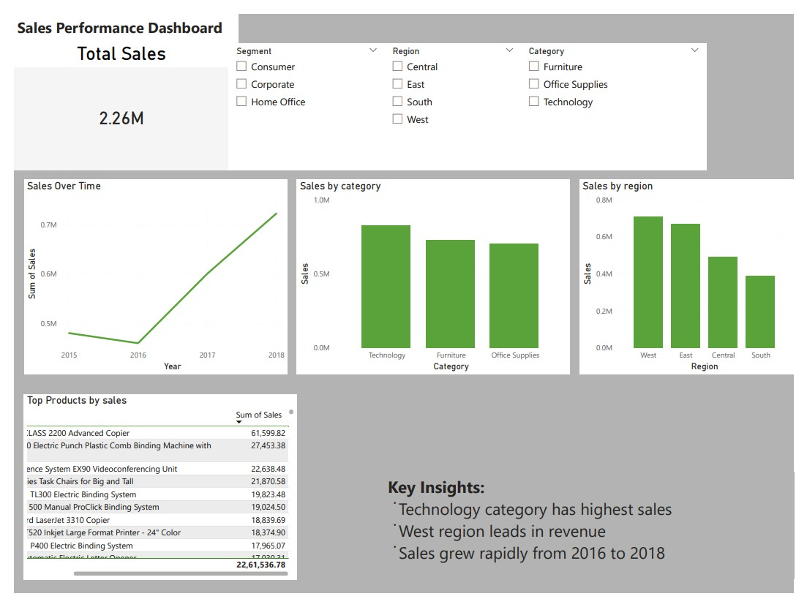

# 📊 Sales Performance Dashboard

## 🔍 Overview

This project presents an interactive Sales Performance Dashboard built using Power BI to analyze sales data across different regions, categories, and time periods.

## 🚀 Key Features

* Total Sales Analysis (2.26M+)
* Sales trends from 2015–2018
* Category-wise and Region-wise performance
* Interactive filters (Region, Segment, Category)
* Top-performing products analysis

📈 Key Insights

* Technology category generated the highest sales
* West region is the top-performing region
* Significant growth observed between 2016–2018

 🛠️ Tools Used

* Power BI
* Excel / CSV dataset

📸 Dashboard Preview

📂 Files Included

* Power BI file (.pbix)
* Dataset
* Dashboard PDF

## 🎯 Purpose

This project demonstrates data visualization, business analysis, and dashboard design skills for data analytics roles.
